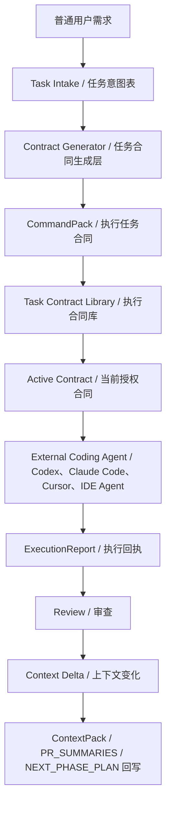

# AI Engineering Collaboration Kit  
# AI 工程协作规范套件

> 让 AI 编程从“凭感觉改代码”，升级为“有上下文、有范围、有门禁、有回滚、有报告”的工程协作流程。

## 这是什么

这不是一套“怎么让 AI 写代码更厉害”的提示词技巧集合。

这是一套面向 AI 编程时代的工程协作框架，用来帮助开发者在使用 Codex、Claude、Copilot、Cursor、IDE Agent、CLI Agent 等工具时，建立清晰的：

- 项目上下文
- 模块边界
- 任务合同
- 编码规范
- 质量门禁
- 回滚方式
- 执行报告

它解决的不是“AI 会不会写代码”，而是：

> 项目如何给 AI 提供足够清楚的上下文、边界、规则和验证方式，让 AI 在真实仓库中稳定工作。

## 你可能遇到过这些问题

AI 明明能写代码，但项目越改越乱。

你可能遇到过：

- AI 顺手重构了不该动的文件；
- 新逻辑被塞进 `main.js`、`index.js`、`App.tsx` 这类中央大文件；
- 每次新对话都要重新解释项目背景；
- AI 没有跑测试，却说"已经完成"；
- 中文文档、UI 文案或 Markdown 被写乱码；
- 你反复提醒 AI：不要动登录、支付、license、数据库；
- 文档写了但不更新，ContextPack、ModuleBoundary、PR 记录慢慢变成死文件；
- 改完以后不知道怎么回滚，也不知道 AI 到底改了哪些地方。

这套 Kit 解决的不是"让 AI 更自由"，而是让 AI 在上下文、任务合同、修改边界、质量门禁和回滚规则下执行。

## 从 vibe coding 到工程协作

| Vibe Coding | AI Engineering Collaboration |
|---|---|
| 用户临时描述需求 | Task Intake 结构化采集任务意图 |
| AI 凭感觉改代码 | CommandPack 锁定本次执行合同 |
| 不知道该读哪些上下文 | ContextPack L1 / L2 / L3 按风险读取 |
| 允许范围不清楚 | 用户语义边界 → 规划层推断路径 → 执行代理验证 |
| 乱改文件、顺手重构 | allowed / forbidden paths + STOP 条件 |
| 没跑测试也说完成 | gates + ExecutionReport |
| 文档创建后不更新 | Context Delta + Context Writeback |
| 多个任务容易混乱 | Task Contract Library 只允许 active 合同执行 |
| 项目记忆断裂 | PR_SUMMARIES / NEXT_PHASE_PLAN / ContextPack 持续沉淀 |

## 核心闭环



这条链路的核心是：

- 普通用户不需要直接写完整 CommandPack；
- 任务合同由规划层根据上下文生成；
- 只有 active 合同可以交给执行 Agent；
- 执行结果必须通过 ExecutionReport 回传；
- 项目真实变化通过 Context Delta 回写到长期上下文。

它不是一键自动写代码工具，也不替代人的产品判断。
它更像是 AI 编程项目的工程协作规则底座：负责上下文、任务合同、边界、门禁、回滚和报告。

## 核心原则

> 人负责方向、边界、判断和验收。  
> AI 负责在明确任务合同下执行。  
> 仓库文档负责保存长期上下文。  
> 测试和门禁负责验证结果。

## 适用场景

适合：

- 你正在用 Codex / Claude / Copilot / Cursor / IDE Agent 开发项目。
- 你想让 AI 修改代码更稳定、更可靠。
- 你的项目越来越复杂，AI 开始频繁乱改文件。
- 你经常需要重复向 AI 解释项目结构。
- 你担心中文文档、UI 文案、JSON、Markdown 被写乱码。
- 你想建立 AI 编程的质量门禁、回滚策略和审查流程。
- 你希望团队中的 AI 协作方式可复盘、可审计、可持续维护。

不适合：

- 你只想快速做一个一次性 demo。
- 你希望 AI 完全自动决定产品方向和架构。
- 你不准备维护任何项目文档、测试或门禁。
- 你只想要一组短 prompt，而不是工程流程。
- 你不关心项目长期维护、可回滚、可审查。

## 我该从哪里开始？

如果你不懂代码：

1. 读 `SELF_DIAGNOSIS.md`
2. 读 `QUICK_START.md`
3. 填 `templates/TASK_INTAKE.md.template`

如果你已经有项目：

1. 用 `SKILL.md + CommandPack` 跑最小流程
2. 按需补 `AGENTS.md`
3. 按需补 `CONTEXT_PACK.md`
4. 项目复杂后再补 `MODULE_BOUNDARY.md` / `TESTING.md`

如果你是工程用户：

1. 读 `USAGE.md`
2. 看 `templates/CommandPack.md.template`
3. 按项目复杂度选择使用模式

文件太多不知道怎么选时，先看：

- `docs/10-file-roles-and-usage-modes.zh-CN.md`

---

## 工程概念基础

如果你不熟悉门禁、依赖、权限、幂等、并发、部署、回滚、schema、migration 等工程概念，建议先阅读：

- `docs/11-engineering-concepts-foundation.zh-CN.md`

这份文档不是编程教程，而是 AI 编程用户需要理解的工程概念地图。

## 任务合同生成层

普通用户不需要直接写完整 CommandPack。

推荐流程是：

1. 用户填写 Task Intake；
2. 规划型 AI / 强模型 / 项目负责人生成 CommandPack；
3. CommandPack 进入执行合同库；
4. 只有 active 合同可以交给执行 Agent 执行。

详见：[`docs/12-commandpack-generation-layer.zh-CN.md`](docs/12-commandpack-generation-layer.zh-CN.md)

---

## 包含内容

本仓库包含四类内容：

### 1. 给人的项目协作手册

告诉项目负责人：

- 一个新项目开始前应该先建立哪些文档。
- 为什么不要一开始就让 AI 直接写功能。
- 如何设计 README、AGENTS.md、ContextPack、模块边界、测试门禁。
- 每次迭代如何生成 CommandPack。
- AI 执行完成后，人应该如何审查和收口。

入口文档：

- `docs/01-ai-project-collaboration-handbook.zh-CN.md`

### 2. 给 AI 执行代理的执行规范

告诉 Codex / IDE Agent / CLI Agent：

- 修改前必须读哪些上下文。
- 如何锁定任务范围。
- 如何避免中文乱码。
- 如何避免把逻辑堆进中央大文件。
- 什么时候 FAST / SAFE / AUDIT。
- 什么情况必须 STOP。
- 如何输出 ExecutionReport。

入口文档：

- `skills/codex-ide-executor-zh/SKILL.md`（路由型 Skill，AI 日常执行入口）
- `skills/codex-ide-executor-zh/SKILL_RUNTIME.md`（可选更短 Runtime 摘要）
- `docs/02-agent-execution-spec.zh-CN.md`（人类可读 canonical 完整规范，维护/审计用）
- `skills/codex-ide-executor-zh/references/FULL_EXECUTION_SPEC.zh-CN.md`（Skill 自包含完整规范引用副本，维护/审计用）

### 3. 可复制的项目模板

包括：

- `AGENTS.md`
- `CommandPack`
- `CONTEXT_PACK.md`
- `MODULE_BOUNDARY.md`
- `TESTING.md`
- `PR_SUMMARIES.md`
- `.editorconfig`
- `.gitattributes`
- `.gitignore`

目录：

- `templates/`

### 4. 脚本和示例

包括：

- UTF-8 / 疑似乱码检查脚本。
- 项目结构验证脚本。
- 项目骨架初始化脚本。
- Node CLI、Electron App、Web Service 示例骨架。

目录：

- `scripts/`
- `examples/`

## ContextPack 分层

默认推荐：

- `docs/CONTEXT_PACK.md`：L1 最小上下文入口
- `docs/context/CONTEXT_PACK_L2.md`：深入协作上下文
- `docs/context/CONTEXT_PACK_L3.md`：审计 / 交接上下文

AI 不应每次默认读取全部上下文，而应按任务风险读取对应层级。

ContextPack 不应该等项目后期才一次性生成。

推荐流程：

1. 用 `PROJECT_INTAKE.md.template` 收集项目基本情况。
2. 生成初始 L1 ContextPack。
3. 每个重要任务后记录 Context Delta。
4. 阶段性整理 L2 / L3。

未来 CLI / 插件可以自动生成，但在此之前，可以由项目负责人、规划型 AI 或执行代理在授权范围内维护。

详见：[`docs/09-contextpack-lifecycle.zh-CN.md`](docs/09-contextpack-lifecycle.zh-CN.md)

## 运行时最小读取原则

完整执行规范很完整，但不适合每次任务全量读取。

AI 日常执行任务时，不需要默认读取所有项目文档。

最小运行时只需要：

1. 当前任务合同：`CommandPack`
2. 执行规则入口：`skills/codex-ide-executor-zh/SKILL.md`

其中：

- `CommandPack` 说明本次要做什么、不做什么、允许改哪里、禁止改哪里、必跑什么门禁。
- `SKILL.md` 是压缩执行器，负责判断 FAST / SAFE / AUDIT、STOP 条件、UTF-8、防屎山、门禁和报告要求。

按需读取：

- `.ai_rules.md`
- `AGENTS.md`
- `docs/CONTEXT_PACK.md`
- `docs/MODULE_BOUNDARY.md`
- `docs/TESTING.md`
- 相关源码和测试

维护 / 审计资料：

- `docs/02-agent-execution-spec.zh-CN.md`
- `skills/codex-ide-executor-zh/references/FULL_EXECUTION_SPEC.zh-CN.md`

一句话：

> 完整规范是母版，Skill 是压缩执行器，CommandPack 是本次任务合同。AI 平时只需要后两者。

## 文档不是死文件

本套规范依赖仓库文档保存长期上下文，这些文档不是一次性说明。

重要变更后，应同步更新项目文档。以下路径是本套件推荐的标准模板路径，实际项目可以按自己的文档结构调整，Skill 不强制所有项目使用完全相同的文件名：

- `docs/CONTEXT_PACK.md`（项目上下文）
- `docs/MODULE_BOUNDARY.md`（模块边界）
- `docs/TESTING.md`（测试门禁）
- `docs/PR_SUMMARIES.md`（迭代记录）
- `MANIFEST.md`（文件清单）
- `CHANGELOG.md`（变更日志）

如果项目采用不同名称，可在 CommandPack / AGENTS.md / `.ai_rules.md` 中声明。

如果 AI 没有权限更新相关文档，必须在 ExecutionReport 中明确标记需要回写。

- `.ai_rules.md`：项目级规则摘要，按需使用，由 CLI / 人工从 `templates/AI_RULES.md.template` 生成。
- `SKILL_RUNTIME.md`：Skill 内部的可选更短 Runtime 摘要，不是必须让用户每次额外提供的文件。

## 如何让 AI 使用这套规范

不要每次把完整规范塞给 AI。

日常任务只需要给 AI 两样东西：

1. 当前 `CommandPack`
2. `skills/codex-ide-executor-zh/SKILL.md`

`CommandPack` 是本次任务合同。  
`SKILL.md` 是压缩执行器，负责让 AI 判断任务模式、锁定范围、执行门禁、输出报告。

如果任务需要更多上下文，再按需读取：

- `.ai_rules.md`
- `AGENTS.md`
- `docs/CONTEXT_PACK.md`
- `docs/MODULE_BOUNDARY.md`
- `docs/TESTING.md`
- 相关源码和测试

完整规范不作为日常 AI 上下文。遇到高风险、不明确或规则冲突时，AI 应 STOP，而不是自行读取完整规范继续执行。

本套件不是要求 AI 机械地遇到任何小问题都 STOP。在低风险、同因、局部、可验证的条件下，AI 可以处理必要的前置小问题和同类小修复。但涉及权限、license、计费、schema、密钥、生产配置、用户数据、依赖升级、跨模块重构时，必须 STOP。

完整规范是母版，供人类维护、审计、复盘、教学和规范演进使用：

- `docs/02-agent-execution-spec.zh-CN.md`
- `skills/codex-ide-executor-zh/references/FULL_EXECUTION_SPEC.zh-CN.md`

详细使用方式见：

- `USAGE.md`
- `docs/00-how-to-use-with-ai-agent.zh-CN.md`

## 快速开始

### 第一步：先判断你是否需要这套框架

阅读：

```txt
SELF_DIAGNOSIS.md
```

如果你遇到以下问题，这套框架通常会有帮助：

- AI 经常乱改文件。
- AI 把新功能塞进 `main.js`、`index.js`、`App.tsx`、`styles.css`。
- 中文文档或 UI 文案经常乱码。
- 每次都要重新解释项目上下文。
- AI 没有跑测试却说“完成了”。
- 改完代码不知道怎么回滚。

### 第二步：阅读快速开始

```txt
QUICK_START.md
```

按最小流程给你的项目补齐：

- `README.md`
- `AGENTS.md`
- `docs/CONTEXT_PACK.md`
- `docs/MODULE_BOUNDARY.md`
- `docs/TESTING.md`
- `scripts/check_utf8.py`
- `.editorconfig`
- `.gitattributes`

### 第三步：使用 CommandPack 给 AI 发任务

不要直接说：

> 帮我做这个功能。

而是使用：

```txt
templates/CommandPack.md.template
```

把任务目标、允许修改路径、禁止修改路径、必读上下文、门禁和回滚方式写清楚。

### 第四步：要求 AI 输出 ExecutionReport

每次执行完成后，要求 AI 输出：

- 修改了哪些文件。
- 是否遵守范围。
- 是否涉及中文和 UTF-8。
- 是否避免中央大文件膨胀。
- 跑了哪些门禁。
- 哪些检查没跑，为什么。
- 风险是什么。
- 怎么回滚。
- 下一步建议是什么。

## 不会写 CommandPack 怎么办？

你不需要从零手写 CommandPack。

可以先填写：

- `templates/TASK_INTAKE.md.template`
- `templates/PROJECT_INTAKE.md.template`

然后由项目负责人、规划型 AI、CLI、插件或其他协作助理生成正式 CommandPack。

日常执行时，代码执行代理只需要：

1. CommandPack
2. `skills/codex-ide-executor-zh/SKILL.md`

## 推荐目录结构

将本套件应用到你的项目后，推荐你的项目至少具备：

```txt
your-project/
  README.md
  AGENTS.md
  docs/
    PRODUCT_BRIEF.md
    PRODUCT_ARCHITECTURE.md
    MODULE_BOUNDARY.md
    DEV_GUIDE.md
    TESTING.md
    CONTEXT_PACK.md
    PR_SUMMARIES.md
  scripts/
    check_utf8.py
  .editorconfig
  .gitattributes
  .gitignore
```

## 本仓库结构

> 以下为核心结构概览。完整、最新的文件清单以 `MANIFEST.md` 为准。

```txt
ai-engineering-collaboration-kit/
  README.md
  USAGE.md
  SELF_DIAGNOSIS.md
  QUICK_START.md
  AGENTS.md
  MANIFEST.md
  CHANGELOG.md
  LICENSE*

  docs/
    00-how-to-use-with-ai-agent.zh-CN.md
    01-ai-project-collaboration-handbook.zh-CN.md
    02-agent-execution-spec.zh-CN.md
    ...
    12-commandpack-generation-layer.zh-CN.md

    CONTEXT_PACK.md              # L1：上下文入口
    context/
      CONTEXT_PACK_L2.md          # L2：深入协作上下文
      CONTEXT_PACK_L3.md          # L3：审计 / 交接上下文

    MODULE_BOUNDARY.md
    TESTING.md
    PR_SUMMARIES.md
    PRODUCT_BRIEF.md
    PRODUCT_ARCHITECTURE.md
    DEV_GUIDE.md
    NEXT_PHASE_PLAN.md

  skills/
    codex-ide-executor-zh/
      SKILL.md
      SKILL_RUNTIME.md
      references/
      scripts/
      assets/

  templates/
    TASK_INTAKE.md.template
    CommandPack.md.template
    TASK_CONTRACT_LIBRARY.md.template
    CONTEXT_PACK.md.template
    context/
      CONTEXT_PACK_L2.md.template
      CONTEXT_PACK_L3.md.template
    AGENTS.md.template
    AI_RULES.md.template
    MODULE_BOUNDARY.md.template
    TESTING.md.template
    ...

  scripts/
    check_utf8.py
    validate_project_structure.py
    init_project_skeleton.py

  examples/
    01-simple-node-cli/
    02-electron-app/
    03-web-service/
```

## 版本状态

当前版本：`v0.1.16`

完整版本记录详见 `CHANGELOG.md` 和 `docs/PR_SUMMARIES.md`。

## License

本仓库采用双许可：

- 文档、指南、规范：CC BY 4.0
- 脚本、模板、示例代码：MIT

详见：

- `LICENSE-DOCS`
- `LICENSE-CODE`

## 贡献

欢迎提交 issue、案例、模板改进和实践反馈。

请先阅读：

```txt
CONTRIBUTING.md
```

## 一句话总结

这不是一套“让 AI 自动开发项目”的魔法。

它是一套让 AI 编程变得：

> 有上下文、有范围、有边界、有门禁、有回滚、有报告

的工程协作方法。
